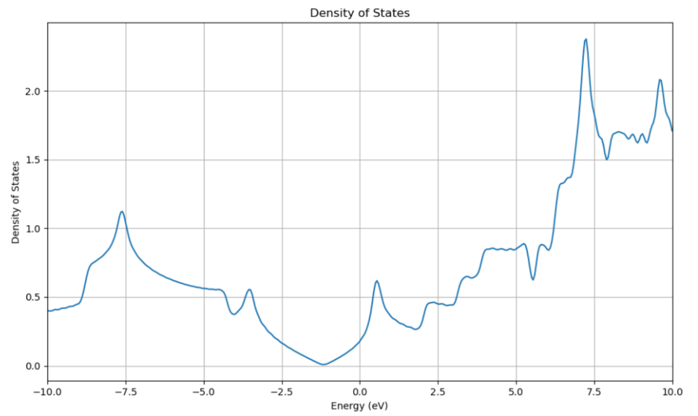
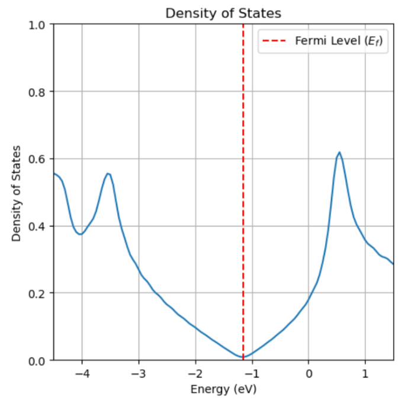

# Graphene Defects Study

## Project Overview
This project investigates the impact of defects on the structural and electronic properties of graphene using computational methods. The study focuses on various types of defects, including vacancies, grain boundaries, and doping (specifically Potassium doping), and their effects on graphene's conductivity, mechanical strength, and reactivity.

## Team Members
- Konstantinos Stergiou
- Ioanna Tampareskou
- Nikolaos Zafeiriadis
- Vasilis Tsioulos

## Theoretical Background
Graphene is a single layer of carbon atoms arranged in a 2D hexagonal lattice structure. It exhibits exceptional electrical, thermal, and mechanical properties. Defects in graphene can significantly alter these properties, making their study critical for applications in electronics, sensors, and energy storage.

## Types of Defects Studied
- **Vacancies**: Missing atoms that disrupt conductivity.
- **Grain Boundaries**: Mismatches in crystal structure that affect mechanical properties.
- **Doping & Oxidation**: Alterations to electronic properties, with a focus on Potassium (K) doping.

## Computational Methodology
### Software
- **Quantum Espresso**: Used for density functional theory (DFT) calculations.

### Key Parameters
- **Pseudopotentials**: C, K
- **Convergence thresholds**: Energy < 1e-6 Ry, Force < 1e-3 Ry/Bohr

### Workflow
1. **Preliminary Study**:
   - Define the primitive cell (2 carbon atoms).
   - Introduce a vacuum gap in the 3rd dimension.
   - Perform structural relaxation (`vc-relax`).
   - Calculate band structure and density of states (DoS).
2. **Defect Study**:
   - Define the supercell.
   - Study Potassium (K) doping effects.

### Convergence Study
- Optimize computational cost by determining optimal `ecutwfc`, `k-points`, and `celldm(3)`.
  - `ecutwfc`: 30 RY (maximum kinetic energy of plane waves).
  - `k-points`: 8 8 1 0 0 (representation of momentum states).
  - `celldm(3)`: Defines vacuum thickness in the z-direction.

#### Convergence Plots
**Figure 1: Total Energy vs `ecutwfc`**  

*The plot shows the convergence of total energy with respect to the plane-wave cutoff energy (`ecutwfc`). The optimal value of 30 RY ensures energy stabilization while minimizing computational cost.*

**Figure 2: Total Energy vs `k-points`**  
  
*The plot demonstrates the convergence of total energy as a function of `k-points` sampling. The chosen grid (8x8x1) balances accuracy and computational efficiency.*

## Key Findings

### Band Structure
A plot of the allowed energy levels of electrons in a material as a function of their momentum (**k**) in the Brillouin zone.

**Features**:
- Dirac cones (Valence & conduction bands touch at K-point).
- Linear dispersion (massless Dirac fermions → high electron mobility).

**Defect Impact**:
- Doping shifts the Fermi level.
- Defects distort the Dirac cone.

**Figure 3: Brillouin Zone of Graphene**  
  
*The hexagonal Brillouin zone of graphene with high-symmetry points (K, Γ, M). The Dirac cones occur at the K-points.*

---

### Vacuum Size Optimization
Due to simulation constraints, a vacuum layer is required to prevent artificial interactions.  
- **Too small**: Unphysical interactions (e.g., electron tunneling).  
- **Too large**: Increased computational cost.  

**Key Parameter**: `celldm(3)`  
- Controls vacuum thickness in the z-direction.  
- Total vacuum = `celldm(3) * celldm(1)` (where `celldm(1)` is the plane-lattice parameter).  

**Goal**:  
Find the smallest `celldm(3)` where energy stabilizes and hydrostatic pressure ≈ 0.  

**Figure 4: Total Energy vs `celldm(3)`**  
  
*Energy convergence with respect to vacuum layer thickness.*  

**Figure 5: Pressure vs `celldm(3)`**  
  
*Hydrostatic pressure approaches zero at optimal vacuum size.*

---

### Introduction to Defects
Defects alter graphene’s electronic, mechanical, and thermal properties. This study focuses on **Potassium (K) doping**, which introduces charge carriers and modifies conductivity.

---

### Density of States (DoS)
A plot of the number of electronic states at each energy level.  

**Pristine Graphene**:  
- V-shaped DoS (reflects linear dispersion).  
- Zero DoS at the Dirac point.  

**Defect Effects**:  
- Doping creates finite DoS at the Fermi level.  
- Defects cause peaks in DoS near the Fermi level.  

**Figure 6: DoS of Pristine Graphene**  
  
*V-shaped DoS with a zero-point at the Dirac energy.*  

**Figure 7: DoS of K-Doped Graphene**  
  
*Additional states near the Fermi level (n-type doping).*  

**Figure 8: Projected DoS (PDOS)**  
  
*Contributions from Carbon p-orbitals (pristine) and K s/p-orbitals (doped).*

---

### Fermi Level Shift
**Pristine Graphene**:  
- Fermi energy at the Dirac point (zero-gap semiconductor).  

**K-Doped Graphene**:  
- Fermi energy shifts into the conduction band (metallic behavior).  

**Figure 9: Fermi Level Comparison**  
 *Pristine* |  *K-Doped*  
*Left: Fermi at Dirac point. Right: Fermi shifts into conduction band.*

---

### Python Script: Charge Transfer Calculation
```python
# Importing Python Packages
import numpy as np
import matplotlib.pyplot as plt
import pandas as pd
from scipy.interpolate import interp1d
from scipy.integrate import quad
from scipy.optimize import minimize

# Reading PDOS Data for K-Doped Graphene
df = pd.read_csv('IntegrationPDOSTotal.csv')
x, y = df['E(eV)'], df['dos(E)']  # x: Energy(eV), y: dos(E)
integral = interp1d(x, y, 'cubic')  # Interpolation

# Calculating the Top of the Valence Band
valence_top = minimize(integral, -0.7)['x'][0]  # Initial guess: -0.7eV
fermi_level = 0.020  # eV
I, I_err = quad(integral, valence_top, fermi_level)  # Integration

```
## Carrier Density
The charge transfer is quantified as follows:

- For a 4×4 supercell (32 Carbon atoms + 1 Potassium atom):  
  **0.4733 electrons/supercell**  
- For the primitive cell (divided by 16):  
  **0.0296 electrons/unit cell**
---

## Conclusions

### SCF (Self-Consistent Field Calculation)
- **Pristine Graphene**:  
  - Zero-bandgap material  
  - Dirac cone at K-point  
- **K-Doped Graphene**:  
  - Electron donation from K shifts Fermi level up (n-type doping)  

### NSCF (Non-Self-Consistent Field Calculation)
- Refines electronic structure for accurate:  
  - Band structure calculations  
  - DOS calculations  

### Band Structure
- **Pristine Graphene**:  
  - Linear bands  
  - Dirac cone at K-point  
- **K-Doped Graphene**:  
  - Modified band structure due to doping  

### DOS (Density of States)
- **Pristine Graphene**:  
  - Vanishing DOS at Dirac point  
  - Linear behavior  
- **K-Doped Graphene**:  
  - Extra states near Fermi level  
  - Increased carrier density  
  - Fermi level shifts up (n-type doping signature)  

### PDOS (Projected Density of States)
- **Pristine Graphene**:  
  - Carbon p-orbitals dominate near Fermi level  
- **K-Doped Graphene**:  
  - K s & p orbitals contribute to DOS  
  - Charge transfer modifies electronic structure  
