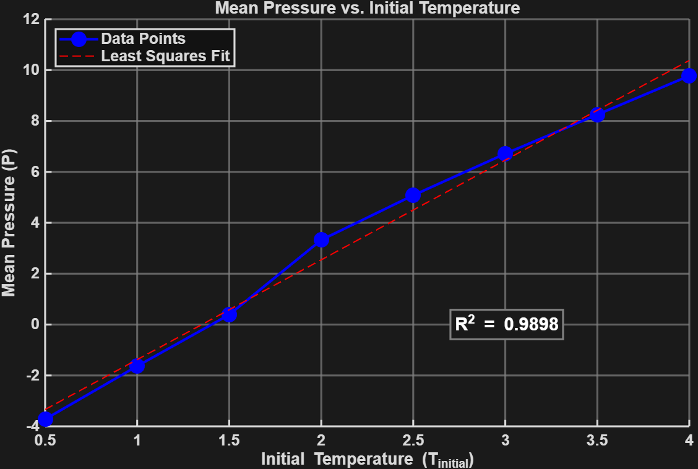

# Project 1: Validation of the Ideal Gas Law via Molecular Dynamics Simulations

This project aims to validate the ideal gas law, \( PV = nRT \), using molecular dynamics (MD) simulations. By employing the provided input file `in.ar.lj.lp.txt`, we conduct NVE simulations in a 3D box containing atoms at various fixed temperatures. After each simulation, pressure and temperature data are extracted and analyzed to evaluate the system's adherence to the ideal gas law. Additionally, simulations are repeated at different temperatures to explore deviations from ideal gas behavior, particularly at lower temperatures.

---

## Analysis

The simulation data is recorded in the `log.lammps` output file, which includes details such as simulation steps, temperature (`Temp`), pairwise interaction energy (`E_pair`), molecular energy (`E_mol`), total energy (`TotEng`), and pressure (`Press`). Initially, the system is not in equilibrium, which explains the stepwise progression observed in the early stages. Equilibrium is achieved in the later stages, making the data from the final steps — where the system stabilizes — the most reliable for analysis.

The analysis examines initial temperatures (`tinitial`) ranging from 0.5 to 4.0 in increments of 0.5, ensuring a comprehensive understanding of the system's behavior, especially at low temperatures. The table below summarizes the results:

### Data Table

| \( T_{initial} \) | Mean Pressure (\( P \)) |
|-------------------|-------------------------|
| 0.5               | -3,720385604            |
| 1.0               | -1,63407693             |
| 1.5               | 0,3874020496            |
| 2.0               | 3,323294898             |
| 2.5               | 5,079244478             |
| 3.0               | 6,712649256             |
| 3.5               | 8,250409912             |
| 4.0               | 9,774913108             |

The following plot visualizes these findings:



The plot demonstrates a linear relationship of the form \( Y = aX \), with a high coefficient of determination (\( R^2 = 0.9898 \)), indicating a strong correlation between the simulated data and the ideal gas law. This relationship can be expressed as:

\[
Y = aX \\
P = \frac{nR}{V} \cdot T  
\]

where \( a = \frac{nR}{V} \). However, deviations from the ideal gas law become apparent at lower temperatures due to several factors:

1. **Intermolecular Forces Gain Significance:**  
   At lower temperatures, gas particles move more slowly, allowing attractive forces (e.g., van der Waals forces) to play a more prominent role. These forces reduce the effective pressure exerted by the gas on the container walls, leading to deviations from the ideal gas law.

2. **Finite Volume of Particles:**  
   The ideal gas law assumes gas particles occupy negligible volume. However, at low temperatures, gases become denser, and the finite size of molecules becomes significant relative to the container volume. This effect is accounted for in the van der Waals equation.

3. **Risk of Condensation:**  
   At sufficiently low temperatures, gases may condense into liquids, a phase transition not described by the ideal gas law. In this state, the assumptions of free-moving particles and negligible interactions no longer hold.

4. **Quantum Effects:**  
   At extremely low temperatures, quantum mechanical effects such as Bose-Einstein condensation or Fermi-Dirac statistics become relevant, further invalidating the classical assumptions of the ideal gas law.

These factors collectively explain the observed deviations at lower temperatures, underscoring the limitations of the ideal gas approximation in such regimes.

---

## Files

- `in.ar.lj.lp.txt`: Input file for the LAMMPS simulation.
- `log.lammps`: Output file containing simulation data.
- `trajectory.txt`: Trajectory file with atomic positions.
- `project1_plot.m`: MATLAB code for plotting Mean Pressure vs. Initial Temperature.
- `plot1.png`: Plot of Mean Pressure vs. Initial Temperature.


---

## Usage

To run the simulation, use the following command:

```bash
lmp -in in.ar.lj.lp.txt
