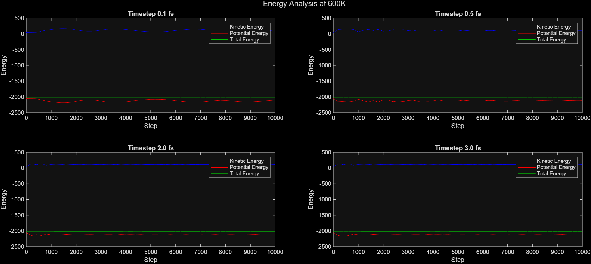
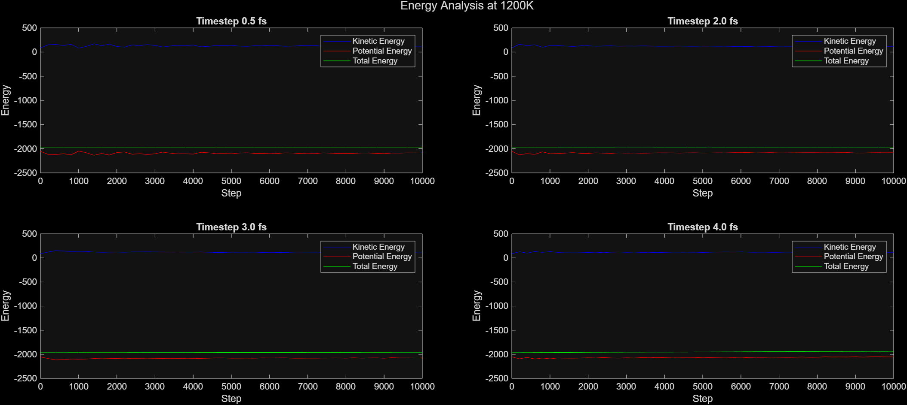
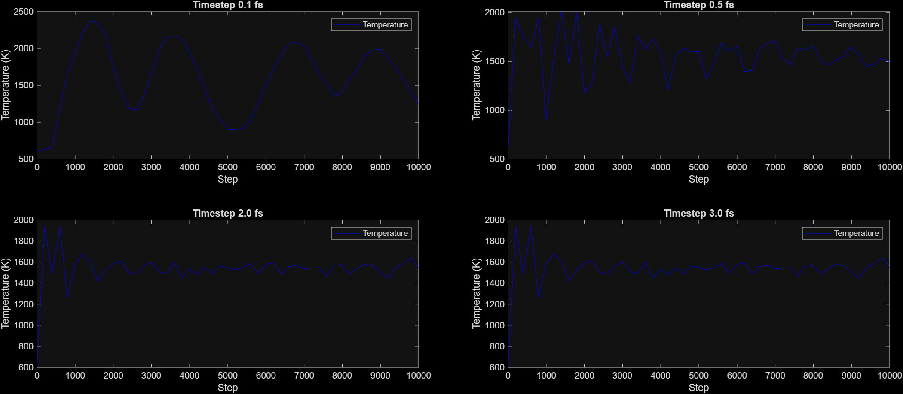
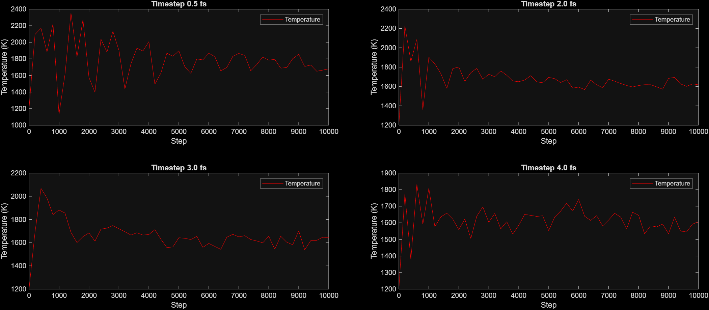
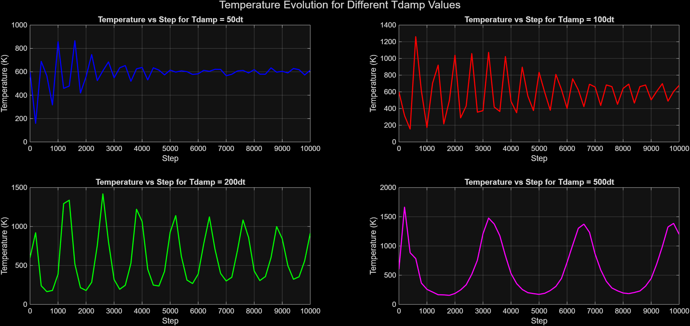

# Project 2: Optimizing Parameters for Molecular Dynamics Simulations

This project explores the effects of two critical parameters in molecular dynamics (MD) simulations: the **timestep** and the **temperature damping parameter (Tdamp)** of the Nose-Hoover thermostat. The study is divided into two parts:

1. **Timestep Optimization in NVE Ensemble:**  
   We vary the timestep from 0.1 fs to 100 fs in NVE ensemble simulations at two temperatures (600 K and 1200 K) to analyze energy conservation and temperature stability.

2. **Tdamp Optimization in NVT Ensemble:**  
   Using the optimal timestep determined in the first part, we investigate the impact of Tdamp in NVT ensemble simulations. The simulations are performed for a specific material (in this case, Nickel (Ni)) to assess whether optimal parameters vary by material type.

---

## Analysis

### Part 1: Timestep Optimization
To begin, we modified the input and library files to incorporate data for Nickel (Ni). Simulations were conducted at constant temperatures of 600 K and 1200 K, while the timestep was varied to identify its optimal value. Below are the results of this analysis:

  

The plots illustrate the relationship between **Kinetic Energy**, **Potential Energy**, and **Total Energy** as functions of the timestep. Key observations include:
- The optimal timestep was determined to be **0.002 fs**, as this value maintains the system's structural integrity.
- At a timestep of **1.5 fs**, energy components exhibit significant instability, particularly at 1200 K, where both Potential and Total Energy begin to drift upwards.
- A timestep of 1.5 fs is too large, leading to numerical instability, especially at higher temperatures. This is evidenced by the upward trend in Total Energy, indicating energy conservation issues due to integration errors.

### Part 2: Temperature Stability and Standard Deviation
The following plots visualize the standard deviation of temperature for various timesteps:

  

Key findings include:
- Smaller timesteps (e.g., 0.1 fs and 0.5 fs) result in significant temperature fluctuations, indicating poor energy conservation and instability.
- As the timestep increases to **2 fs, 3 fs, and 4 fs**, temperature variations become smoother and more stable, suggesting improved energy conservation and equilibration.
- However, excessively large timesteps may introduce integration errors. Thus, the optimal timestep range for maintaining stability and accuracy lies between **2 fs and 3 fs**.
- Based on the analysis, the **ideal timestep** for this system is determined to be **2 fs**, as it provides a balance between stability and computational efficiency.

In this part of the study, we examine the effect of the temperature damping parameter (`Tdamp`) in a Nose-Hoover thermostat on energy stability for a system at 600 K. The results from this analysis are shown below, in the form of four consecutive plots:

The results show that:
- Lower `Tdamp` values, such as `50.0×dt` and `100.0×dt`, lead to **quicker equilibration** with **smaller energy fluctuations**.
- Higher `Tdamp` values, such as `200.0×dt` and `500.0×dt`, cause **larger and more persistent oscillations**, indicating slower stabilization of the system's energy.
- An **optimal range** for `Tdamp` appears to be between `50.0×dt` and `100.0×dt`, where the system achieves a balance between rapid equilibration and minimal energy fluctuations.

Further analysis is needed to assess potential differences in the behavior of **light and heavy materials**, as their distinct properties may influence the system's energy dynamics and the effectiveness of the thermostat. This additional investigation could provide deeper insights into material-specific responses and help refine the choice of `Tdamp` for specific applications.

---
## Conclusion

This study explored the effects of **timestep** and **temperature damping parameter (Tdamp)** on molecular dynamics (MD) simulations. Key findings include:

1. **Timestep Optimization:**
   - The optimal timestep was determined to be **2 fs**, balancing stability and computational efficiency. Smaller timesteps caused fluctuations, while larger ones introduced integration errors.

2. **Tdamp Optimization:**
   - Lower `Tdamp` values (e.g., `50.0×dt` to `100.0×dt`) led to faster equilibration with minimal energy fluctuations, while higher values caused persistent oscillations.

3. **Material-Specific Considerations:**
   - Further analysis is needed to assess how these parameters vary for different materials, particularly light vs. heavy elements.

These results provide a foundation for stable and accurate MD simulations, with potential extensions to material-specific applications.
