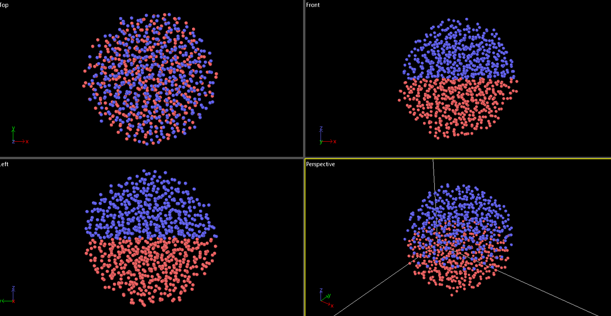
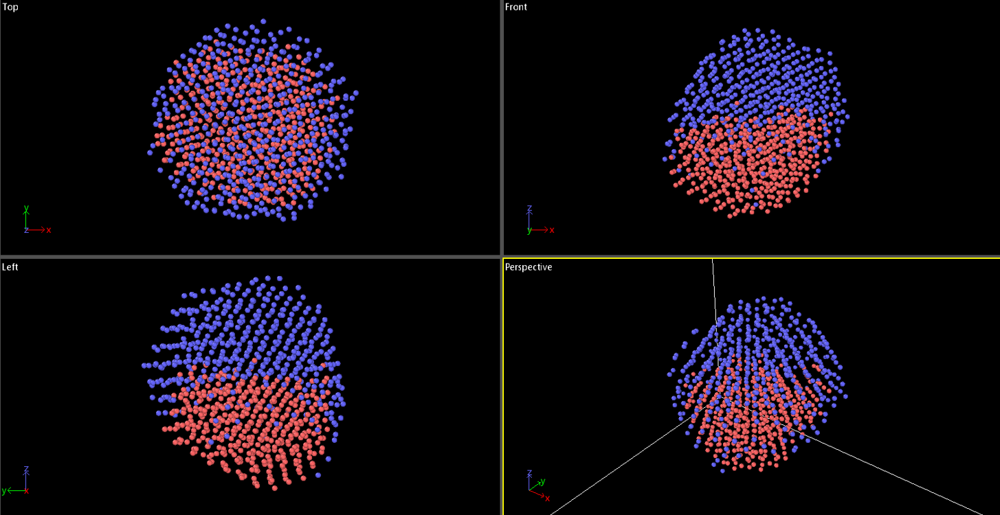
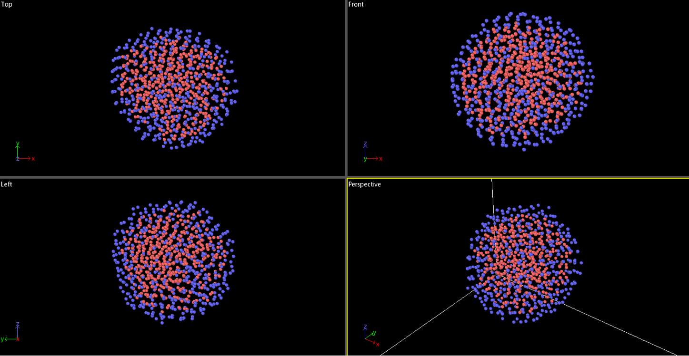

# Project 4: Monte Carlo vs Molecular Dynamics

This project investigates the differences between the **Monte Carlo (MC)** method and **Molecular Dynamics (MD)** simulations. The study focuses on a **923-atom amorphous metallic alloy nanoparticle** at a constant temperature of **400 K**. Two simulations are conducted for the same number of steps: one using the **MD approach** with the `fix nvt` command and the other using **MC** with the `fix atom swap` command. The primary objectives are:

1. To compare how each method explores the system's energy landscape.
2. To assess whether MD can overcome energy barriers that MC can bypass.
3. To evaluate if MC can provide insights into the time evolution of the system.

## Initial State of the System

The image above shows the initial state of the system, represented by the file `923_amorphous_1.txt`. Both MC and MD simulations were run for **500,000 time steps**.

## Results

### Molecular Dynamics (MD) Simulation

The MD simulation is highly effective for calculating the **dynamic processes** of the system. However, it has limitations when it comes to mixing different types of molecules, as certain **theoretical energy barriers** cannot be overcome.

### Monte Carlo (MC) Simulation

In contrast, the MC simulation does not involve dynamic processes but instead focuses on exploring **possible equilibrium states**. The final result represents the **most probable equilibrium state**, effectively bypassing the energy barrier issues encountered in the MD simulation.

## Key Findings

- **MD Simulation**: Ideal for studying dynamic processes but limited by energy barriers.
- **MC Simulation**: Excellent for identifying equilibrium states and overcoming energy barriers, but lacks dynamic evolution.

This comparison highlights the complementary strengths of both methods in understanding complex systems.
